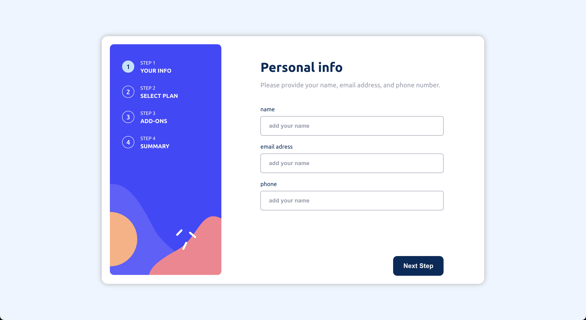

# Frontend Mentor - Multi-step form solution

This is a solution to the [Multi-step form challenge on Frontend Mentor](https://www.frontendmentor.io/challenges/multistep-form-YVAnSdqQBJ). Frontend Mentor challenges help you improve your coding skills by building realistic projects.

## Table of contents

- [Overview](#overview)
    - [The challenge](#the-challenge)
    - [Screenshot](#screenshot)
    - [Links](#links)
- [My process](#my-process)
    - [Built with](#built-with)
    - [What I learned](#what-i-learned)
    - [Continued development](#continued-development)
    - [Useful resources](#useful-resources)
- [Author](#author)
- [Acknowledgments](#acknowledgments)

## Overview

### The challenge

Users should be able to:

- Complete each step of the sequence
- Go back to a previous step to update their selections
- See a summary of their selections on the final step and confirm their order
- View the optimal layout for the interface depending on their device's screen size
- See hover and focus states for all interactive elements on the page
- Receive form validation messages if:
    - A field has been missed
    - The email address is not formatted correctly
    - A step is submitted, but no selection has been made

### Screenshot



### Links

- Solution URL: [Solution URL](https://github.com/amjadsh97/form-stepper)
- Live Site URL: [Live site](https://form-stepper-theta.vercel.app/)

## My process

### Built with

- Semantic HTML5 markup
- CSS custom properties
- Flexbox
- [React](https://reactjs.org/) - JS library
- [Yup](https://www.npmjs.com/package/yup) - for validation

### What I learned

During the project, I implemented a component named Step for each stage. The Step component applies the 'active-step' CSS class when the step is currently active.
```js
	const Step = ({number, name, isActive}) => {
	return (
		<li className={`${isActive ? 'active-step' : ''} step-wrapper`}>
			<span className='step-number'>{number}</span>
			<div className="step-info">
				<p className="step-number">STEP {number}</p>
				<p className="step-name">{name}</p>
			</div>
		</li>
	)
}

<ul className="steps" style={bgStyle}>
	<Step number={1} name={'your info'} isActive={activeStep === 1}/>
	<Step number={2} name={'select plan'} isActive={activeStep === 2}/>
	<Step number={3} name={'add-ons'} isActive={activeStep === 3}/>
	<Step number={4} name={'summary'} isActive={activeStep === 4}/>
</ul>

```
This structure allows for clear visualization of each step in the process, with the active step dynamically highlighted based on the current state.


### Continued development

Moving forward, my focus will remain on enhancing my proficiency in state management techniques and ensuring seamless state handling throughout my projects.

### Useful resources

- [React Docs](https://react.dev/) - This helped me for building react components. I really liked using this docs.
- [Yup docs](https://github.com/jquense/yup) - This is an amazing article for understand Yup.

## Author

- Website - [Amjad Shadid](https://amjadshadid.vercel.app/)
- Frontend Mentor - [@amjadsh97](https://www.frontendmentor.io/profile/amjadsh97)
- Twitter - [@Amjadshadid](https://twitter.com/Amjadshadid)
- Linkedin - [@Amjad Shadid](https://www.linkedin.com/in/amjad-shadid-134355134/)